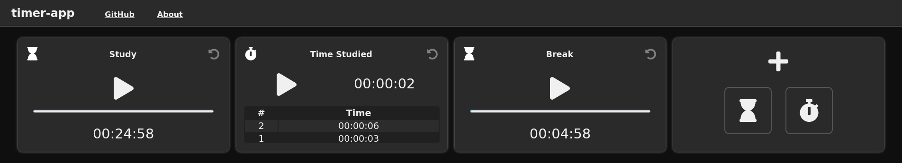

# timer-app

A timer app for the browser created using ReactJS that aims for a clean UI and convenient features.



<hr>

## [Live Demo](https://sahilm.tk)
The app is now live on https://sahilm.tk

## Features:
- Multiple timers
- Automatic saving of timer data
- Progress Bar
- Nameable timers

## Issues?
Found a bug or something that bugs you?
Fork it, fix it, and create a pull request.

Or you can create an issue and I might address it.

## To run locally:
Have npm installed.

Clone with 
  ```git clone https://github.com/sahilMujadedi/timer-app```

Go into the "timer-app" directory and run
  ```npm install```
to install dependencies.

Run
  ```npm start```
to start server on localhost:3000 (on default configuration).
  
## To-do:
- Play a sound when timer is finished
- About and Contact links
- Bigger timer text without ruining look
- Style finished timer